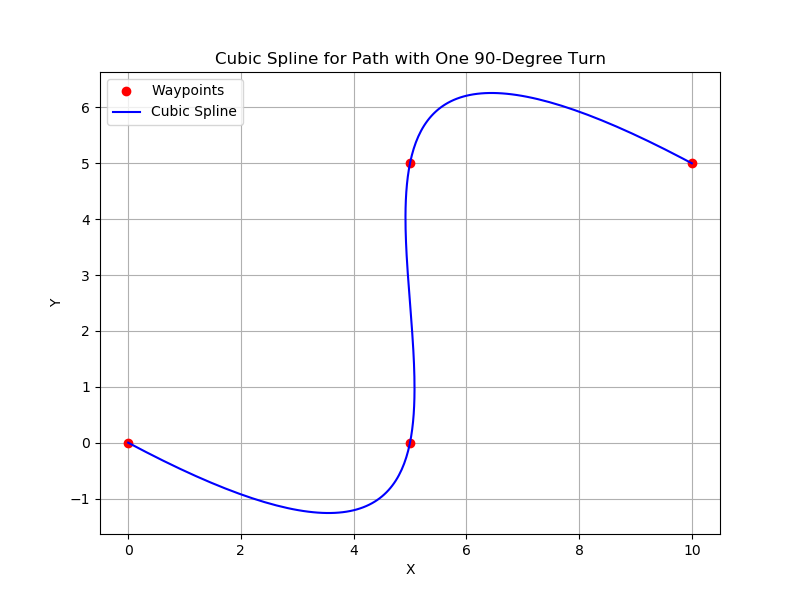

# Information
Team: DriveBeyond  
Date: 20/01/2024  
Description: This is a report article on the status of project 2.

# 📋 Table of Contents

* [Task 1 Speed calibration](#task-1-speed-calibration)  
* [Task 2 Smoothing the raw path](#task-2-smoothing-the-raw-path)  
* [Task 3 Implementing lane detection and lane keeping](#task-3-implementing-lane-detection-and-lane-keeping)  
* [Task 4 Training a model for sign detection](#task-4-training-a-model-for-sign-detection)  
* [Task 5 Building camera-based indoor localization system](#task-5-building-camera-based-indoor-localization)  
* [Task 6 Control the car to follow paths ](#task-6-control-the-car-to-follow-paths)  

# Task 1 Speed calibration
## 📂 Project Directory Structure
```bash
~/project-status-1/ 
/src/task_1
├── reading_velocity.ino
└── speedingmotor.hpp
```

## 📝 Description
   Use a rotary encoder attached to the motor shaft to measure speed, or attach 5 magnets to the wheel and use a magnetic sensor combined with an Arduino to read pulses, thereby calculating the speed. Send speed control commands, compare them with the actual speed, and adjust the step value accordingly

**Read pulses from the encoder to compute the speed**  
   - File: `reading_pulse.ino`
   - Functionality: Read pulses from the encoder to compute the speed.  

**Adjust the step value accordingly**  
   - File: `speedingmotor.hpp`
   - Functionality: Adjust the step value to make the actual speed closely match the theoretical speed.


# Task 2 Smoothing the raw path
## 📂 Project Directory Structure
```bash
~/project-status-2/ 
/src/task_2
└── Path_smoothing.py
```
## 📝 Description
    Since the raw path from the pathfinding algorithm consists of discrete waypoints, the cubic spline algorithm was used to generate a continuous trajectory that interpolates through a given set of waypoints. This technique helps reduce sudden changes at sharp corners and make the control algorithm more stable.

**Draw spline**  
   - File: `Path_smoothing.py`  
   - Functionality: Using the cubic spline algorithm to interpolate a curve between the waypoints.

 


# Task 3 Implementing lane detection and lane keeping
## 📂 Project Directory Structure
```bash
~/project-status-2/ 
/src/task_3
├── detector.py
├── connection.py
└── autopilot.py
```
## 📝 Description
Lane following leverages the contrast between lane markings and the road. It detects and segments lane markings to identify the midlane or follow the lane's curvature for guiding the vehicle.

**Curve angle calculation via lane segmentation**  
   - File: `detector.py`  
   - Functionality: This script defines a class that receives frames from `threadCamera.py` and calculates the angle for the car to stay in lane.

**Communication between `detector.py` and  `autopilot.py` with frame debugging**  
   - File: `connection.txt`  
   - Functionality: This script uses sockets to send angle values to autopilot.py for automatic steering and serves as a frame debugger for tasks like segmentation.

**Automatic Steering**
- File: `autopilot.py`
- Functionality: This script establishes a serial connection with the vehicle's controller to send speed and steering commands, receives angle data via sockets to calculate the required steering parameter.


# Task 4 Training a model for sign detection
## 📂 Project Directory Structure
```bash
~/project-status-2/ 
/src/task_4
├── scheduler.py
├── SignDetectionTest.py
└── SignDetectionTrain.py
```

## 📝 Description
Sign detection focuses on identifying and classifying traffic signs to enhance vehicle decision-making in autonomous systems. The system leverages a machine learning model trained on traffic sign datasets to detect and interpret signs in real-time.

**Model Training for Traffic Sign Detection**  
   - File: `signDetectionTrain.py`
   - Functionality: This script trains a traffic sign detection model using a labeled dataset. It includes data preprocessing, model training, and saving the trained model for inference.
**Automation and Scheduling**  
   - File: `scheduler.py` 
   - Functionality: This shell script automates the training by specifying how many times we need to retrain, epochs, batchsize and which YOLO model to use


# Task 5 Building camera-based indoor localization system
## 📂 Project Directory Structure

```bash
~/project-status-2/ 
/src/task_5
├── receive_image_from_pi.py
├── calibration_process.py
├── aruco_detector.py
├── marker_manager.py
├── relative_pose.py
├── visualizer.py
├── connection.py
└── main.py
```
## 📝 Description
This folder focuses on indoor localization by utilizing ArUco markers to estimate the coordinates of a vehicle. The process involves capturing images from a Raspberry Pi camera, calibrating the camera, detecting markers, and estimating the vehicle's position. The computed coordinates are then transmitted to the vehicle for trajectory tracking.

### Register and Capture Images
- File: `receive_image_from_pi.py`
- Functionality: Captures images from the Raspberry Pi camera and stores them in the `Calib_pi` folder for further processing.

### Camera Calibration
- File: `calibration_process.py`
- Functionality: Performs calibration of the Pi camera module by estimating the **Intrinsic Matrix** and **Distortion Coefficients** for accurate localization.

### ArUco Marker Detection
- File: `aruco_detector.py`
- Functionality: Detects ArUco markers in the images and estimates the pose of a specific marker.

### Marker Management
- File: `marker_manager.py`
- Functionality: Manages information about each ArUco marker and integrates with `main.py` to ensure proper tracking of specified markers.

### Compute Relative Pose
- File: `relative_pose.py`
- Functionality: Computes transformation matrices and infers the **global coordinates** of the vehicle based on relative positions.

### Visualization
- File: `visualizer.py`
- Functionality: Visualizes detected markers, coordinates, and other relevant information, providing a clear graphical representation of the localization results.

### Coordinate Transmission
- File: `connection.py`
- Functionality: Sends detected coordinate values to the vehicle through sockets, facilitating real-time trajectory tracking and position updates.

### Main Execution
- File: `main.py`
- Functionality: Acts as the central script, handling marker detection, position inference, and coordination with other modules. Sends the vehicle's position information via sockets for trajectory tracking.


# Task 6 Control the car to follow paths
## 📂 Project Directory Structure

```bash
~/project-status-2/ 
/src/task_6
├── control_car_with_pure_pursuit.py
├── pure_pursuit.py
├── coordinates.txt
└── vehicle_control_system.py
```
## 📝 Description
Using the pure pursuit algorithm combined with spline curves to generate a trajectory, enabling the vehicle to follow the path.

### Simulate Pure pursuit algorithm
- File: `pure_pursuit.py`
- Functionality: Cho các giá trị về quỹ đạo đường đi, tọa độ ban đầu, vận tốc để mô phỏng đánh giá thuật toán 

### Reading and writing the data to control vehicle 
- File: `vehicle_control_system.py`
- Functionality: Read the angle data from the IMU sensor and the vehicle's position coordinates from task_4, then send this data to the control_car_with_pure_pursuit.py file to serve as input data for the Pure Pursuit algorithm processing.

### Control the vehicle to follow the trajectory.
- File: `control_car_with_pure_pursuit.py`
- Functionality: Obtain trajectory edge point data from the coordinates.txt file, apply spline curve interpolation, maintain a constant speed of 110 mm/s, and use the pure pursuit algorithm to calculate the steering angle for following the trajectory.


